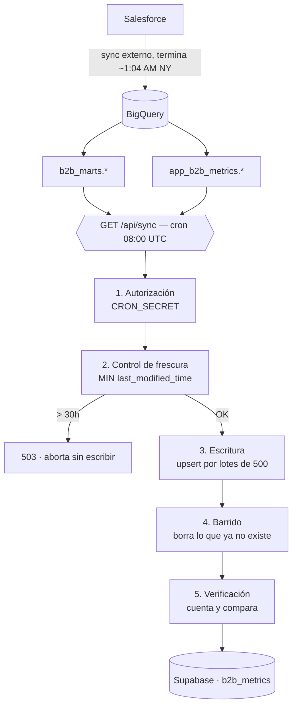

# Arquitectura de simo-sync

Job de sincronización BigQuery → Supabase. Corre una vez al día por cron de
Vercel y deja las tablas de `b2b_metrics` como espejo de las vistas de
BigQuery, que a su vez derivan de Salesforce.

Documento en español porque describe decisiones de negocio; el código y los
mensajes de commit están en inglés.

---

## Vista general



El orden importa: la frescura se evalúa **antes** de escribir nada, y la
verificación corre **después** del barrido para que los conteos reflejen el
estado final.

- **Ruta:** `app/api/sync/route.ts`
- **Cron:** `vercel.json` → `0 8 * * *` (08:00 UTC)
- **Clientes compartidos:** `lib/bigquery.ts`, `lib/supabase.ts`
- **Límite de ejecución:** `maxDuration = 300` (requiere plan Pro)

### Por qué 08:00 UTC

La sincronización Salesforce → BigQuery termina cerca de la 1:04 AM hora de
Nueva York, o sea 05:04 UTC en horario de verano y 06:04 UTC en invierno.
Las 08:00 UTC dejan entre 2 y 3 horas de margen todo el año, sin depender de
en qué mitad del año estemos.

---

## Las cinco tablas

| # | Origen (BigQuery) | Destino (Supabase `b2b_metrics`) | Llave de conflicto | Renombres |
|---|---|---|---|---|
| 1 | `b2b_marts.fct_leads` | `leads_v2` | `lead_id` | `realtor_bd` → `realtor_bd_name` |
| 2 | `b2b_marts.fct_opportunities` | `opportunities_v2` | `opportunity_id` | `realtor_bd` → `realtor_bd_name` |
| 3 | `b2b_marts.fct_calls_daily` | `calls_daily` | `call_date, bd_id, record_type` | `bd_name` → `assigned_to` |
| 4 | `b2b_marts.dim_bd` | `dim_bd` | `bd_id` | — |
| 5 | `app_b2b_metrics.realtor_owner_map` | `realtor_owner_map_v2` | `realtor_key` | — (15 columnas, mismo nombre) |

Los renombres se hacen en SQL (`AS`) dentro de la proyección, no mapeando
objetos en JavaScript. Un renombre mal escrito falla en la consulta, no
silenciosamente al insertar.

Las tablas destino y sus llaves primarias **ya existen**. El job nunca las
crea ni las altera, y nunca usa `TRUNCATE`.

### Escritura

Lotes de 500 filas con `upsert` y `onConflict`. `leads_v2` ronda las 24,700
filas, o sea unos 50 viajes de ida y vuelta solo para esa tabla.

Si una tabla falla, las demás siguen. Un fallo parcial es mejor que ninguna
actualización, y la respuesta dice cuál falló.

---

## Control de frescura

Antes de escribir una sola fila:

```sql
SELECT MIN(last_modified_time) AS oldest_last_modified_time
FROM salesforce.__TABLES__
WHERE table_id IN ('Lead', 'Opportunity', 'Task', 'User')
```

Si el dato tiene **más de 30 horas**, el job responde **503 sin escribir
nada**. Si la sonda no devuelve un valor legible, también aborta con 503:
una pregunta de frescura que no se puede contestar no se asume como "seguro
está bien".

**Es `MIN`, no `MAX`.** Con `MAX` bastaría que una sola tabla se hubiera
sincronizado a tiempo para pasar el control. Si `Task` se actualizó hoy pero
`Lead` quedó tres días atrás, `MAX` daría verde y el job escribiría leads
viejos encima de los buenos. La tabla más atrasada manda.

El criterio de fondo: es preferible que la app conserve los datos de ayer a
que alguien los reemplace por los de anteayer sin enterarse.

---

## Barrido

Después de escribir cada tabla:

```sql
DELETE FROM <tabla> WHERE synced_at < <marca de esta corrida>
```

Antes existía solo el upsert, así que una fila borrada en Salesforce se
quedaba para siempre en Supabase e inflaba los conteos de la app. Leads,
oportunidades y llamadas son copias reconstruibles de Salesforce; Salesforce
manda.

### `synced_at` se escribe explícitamente

Se calcula **una sola marca de tiempo al inicio de la corrida** y se escribe
en cada fila de cada lote de las cinco tablas.

No se puede depender del `DEFAULT now()` de la columna: ese default solo
corre en el `INSERT`. En un upsert que actualiza una fila existente nunca se
refresca, así que la columna quedaría congelada en la fecha de inserción
original y el barrido no podría distinguir una fila recién actualizada de una
abandonada.

Usar una única marca para toda la corrida evita además que las dos mitades
—escritura y barrido— discrepen sobre qué significa "esta corrida".

### Las tres condiciones

El barrido de una tabla corre **solo si se cumplen las tres**:

1. **La escritura de esa tabla terminó sin ningún error.** Cualquier fallo
   lanza excepción antes de llegar al barrido.
2. **`filas_bigquery > 0`.** Si el origen devolvió cero filas, no se barre.
   Vaciar la tabla ahí sería confundir una falla de origen con un borrado
   real.
3. **La tabla está en la lista `SWEEPABLE`** y no está en `NEVER_WRITE`.

`SWEEPABLE` es lista blanca, no lista negra: `leads_v2`, `opportunities_v2`,
`calls_daily`, `dim_bd`, `realtor_owner_map_v2`. Una tabla que se agregue a
`SYNCS` después no es barrible hasta que alguien la nombre aquí a propósito.

> **Supuesto del que depende el barrido:** ninguna de las cinco vistas es
> deslizante. Verificado: `fct_leads` y `fct_opportunities` heredan el filtro
> fijo de sus vistas de origen, y `fct_calls_daily` no tiene filtro de fecha
> (empieza en agosto de 2025 porque ahí empieza `salesforce.Task`). Si alguna
> vista se volviera incremental o con ventana móvil, el barrido borraría todo
> lo que quedara fuera de la ventana. **Revisar esto antes de agregar vistas
> nuevas a `SWEEPABLE`.**

---

## Verificación

El job no reporta éxito porque la llamada no dio error. Después del barrido
cuenta filas en Supabase y las compara contra BigQuery, y devuelve por tabla:

```json
{ "tabla": "...", "filas_bigquery": 0, "filas_supabase": 0,
  "filas_borradas": 0, "coincide": true, "duracion_ms": 0, "error": null }
```

Con el barrido en su lugar el destino es espejo del origen, así que
**`coincide` debe ser exacto siempre**. Un desajuste no es ruido esperado: es
un defecto real, entra en `ok` y la corrida responde **500**.

---

## Decisiones y su razón

### City Lending Inc se excluye de métricas

Era el lender anterior; ahora es Everett. Sus 395 ventas aparecen todas
concentradas en noviembre de 2025 por una migración de datos, no porque se
hayan cerrado ese mes. Dejarlas dentro mete un pico falso en cualquier
métrica por período.

La exclusión vive **aguas arriba**, en las vistas de `b2b_marts`, y llega
aquí como la columna `excluded_from_metrics` de `fct_opportunities`.
`simo-sync` la copia tal cual; no la calcula ni la reinterpreta. Quien
consuma `opportunities_v2` tiene que respetar esa bandera.

### En `realtor_owner_map` gana la fila más reciente por `realtor_key`

La vista está a **grano de oportunidad de reclutamiento, no de realtor**:
4,085 filas sobre 3,873 llaves distintas. Un mismo `realtor_key` aparece
varias veces con owners distintos porque distintos BDs lo trabajaron en
distintos momentos — es su historial, no un duplicado sucio.

Upsertear la vista cruda haría que dos filas del mismo lote cayeran en la
misma llave de conflicto y Postgres rechazaría el lote entero
(*"ON CONFLICT DO UPDATE command cannot affect row a second time"*).

Se colapsa a una fila por llave con `ROW_NUMBER()`, la más reciente primero.
La regla es **"el BD más reciente gana"**: determinista, a diferencia del
`dedupMap` que usa la app hoy, donde gana la última fila del archivo en orden
arbitrario.

Como la vista no expone `opportunity_id` ni ningún identificador único, el
desempate se arma con las columnas que hay:

```sql
ORDER BY created_date           DESC NULLS LAST,
         meeting_attended_date  DESC NULLS LAST,
         invite_sent_date       DESC NULLS LAST,
         last_referral_date     DESC NULLS LAST,
         owner                  ASC
```

Solo con las dos primeras fechas quedaban 3 grupos empatados (6 filas), y en
2 de ellos el owner era distinto: esos realtors habrían cambiado de BD al
azar entre corridas. `owner ASC` al final es arbitrario como criterio de
negocio pero **estable**, que es la propiedad que importa aquí — el mismo
realtor cae siempre con el mismo BD.

*Límite conocido:* en el grupo restante las filas empatan en las cuatro
fechas y comparten owner. El BD queda fijo, pero otras columnas
(`branch`, `stage`, `strategy`) todavía podrían variar entre corridas. No se
cerró porque el owner es lo que consume la app.

### `b2b_metrics.master_assignments` nunca se toca

Tiene 18 filas con `source='manual'`: decisiones humanas sin copia aguas
arriba desde la cual reconstruirlas. Si se sobrescriben, se pierden.

El guard `NEVER_WRITE` la cubre en **ambos** caminos —escritura y barrido—,
no solo en la escritura, y la ruta aborta con 500 si alguna entrada de
`SYNCS` llegara a apuntarle.

### Las vistas de `app_b2b_metrics` dependen de `home_si.leads_borrower`

`app_b2b_metrics` no es autocontenido: se apoya en `home_si.leads_borrower`,
que es del lado de Homesí.

**Cambiar el dataset de Homesí rompe también Metrics B2B.** Es un
acoplamiento entre dos productos que no se ve desde ninguno de los dos
repos, así que cualquier migración o renombre ahí tiene que coordinarse con
este pipeline.

---

## Seguridad

- **Autenticación:** la ruta compara el header `Authorization` contra
  `CRON_SECRET` en tiempo constante (`timingSafeEqual`) y devuelve 401 si no
  coincide. Si `CRON_SECRET` no está configurado, falla cerrado. Sin esto la
  URL quedaría abierta a internet. Vercel inyecta
  `Authorization: Bearer $CRON_SECRET` en las invocaciones de cron.
- **`SUPABASE_SERVICE_ROLE`** solo se usa del lado servidor. `lib/supabase.ts`
  importa `server-only`, así que un import accidental desde un componente de
  cliente rompe el build en vez de filtrar la llave. Nunca se registra en
  logs; los errores de configuración reportan **nombres** de variables, nunca
  valores.
- **BigQuery sin llaves:** la cadena es Vercel OIDC → STS → impersonación de
  service account. No existe ningún JSON de service account en el repo y no
  debe existir. `.gitignore` cubre `.env*`, `*.pem` y patrones de archivos de
  llave.

### Variables de entorno

Se configuran en Vercel, nunca en el repo.

| Variable | Uso |
|---|---|
| `GCP_PROJECT_ID` | Proyecto de BigQuery |
| `GCP_SERVICE_ACCOUNT_EMAIL` | Cuenta a impersonar |
| `GCP_AUDIENCE` | Recurso del proveedor de identidad (target del STS) |
| `SUPABASE_URL` | Endpoint de Supabase |
| `SUPABASE_SERVICE_ROLE` | Escritura server-side, evade RLS |
| `CRON_SECRET` | Autoriza `GET /api/sync` |

> El esquema `b2b_metrics` tiene que estar listado en *Exposed schemas* de la
> API de Supabase. No lo está por defecto: si falta, todas las llamadas dan
> 404 sin importar la llave.

---

## Pendientes

### Restringir el acceso de `simo-sync-bq-reader`

Hoy `simo-sync-bq-reader` tiene lectura sobre **todo** el dataset
`salesforce`, que es más de lo que el job necesita: solo lee las vistas de
`b2b_marts` y `app_b2b_metrics`.

Lo correcto sería autorizar `b2b_marts` sobre `salesforce` y quitarle al
service account el acceso directo, dejándolo leer únicamente las vistas.

**El bloqueo:** el control de frescura consulta `salesforce.__TABLES__`
directamente, y eso deja de funcionar en cuanto se le quita el acceso al
dataset. Restringir los permisos obliga a reemplazar antes el control de
frescura por otro mecanismo —una vista de metadatos expuesta desde
`b2b_marts`, o una columna de watermark en los marts—. No se puede hacer una
cosa sin la otra: quitar el permiso primero deja el job abortando con 503
todas las noches.
